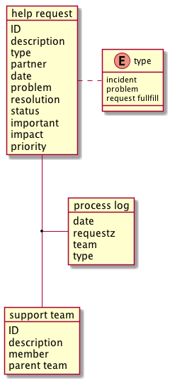

# helpdesk

作为 ITSM 的入口，将用户的请求分发给相应的团队进行处理。

请求 request 可以分为以下类别

- incident 故障，指影响了服务的正常使用
- problem 明确了根源的故障
- query 询问
- service fulfill 服务请求，例如开通帐号

涉及的业务概念

- 服务请求
- 服务团队

1. 服务请求

主要属性

- ID
- description
- type
- partner
- date
- problem
- resolution
- status
- important
- impact
- priority

### 升级规则

request可以向 team的上级team 升级，以便提升重视程度，得到优先处理

### priority calculate matrix

|important / impact  |low  |medium  |high  |
|---------|---------|---------|---------|
|low     |   low      |       low  |     medium    |
|medium     |    low     |    medium     |     high    |
|high     |   medium      |     high    |    high     |